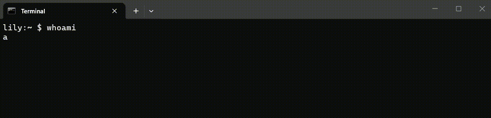

<div align="center">
  

  <h1 align="center">👋 Hi, I'm Lily!</h1>
  
[](https://github.com/lilyfleetingcraig)
[](https://www.linkedin.com/in/lilyfleetingcraig/)


</div>

### 👩‍💻 About me...

```typescript
type Pronouns = "she" | "her";

const lily: Bio = {
  education: {
    degree: "BSc Computing Science 1st Class Hons",
    university: "University of Glasgow"
  },
  languages: ["Python", "Java", "C#", "JavaScript", "TypeScript", "HTML", "CSS"],
  frameworks: ["Django", ".NET", "Spring"],
  research: ["Computing Science Education", "Block-Based Programming", "Spiral Curriculum"]
};
```

### 💻 I’m currently working on...

- [web-blocks](https://github.com/lilyfleetingcraig/web-blocks) - a block-based programming editor for HTML and CSS for novices.
- Plugins to add new code validation and error prevention to [Blockly](https://github.com/RaspberryPiFoundation/blockly).
- My own portfolio.

### 🔭 I work with...

[](#)
          
### 🌱 I’m currently learning...

[](#)

### 🎨 When I'm not programming...

- I design and build stained glass.
- I write and play music.

